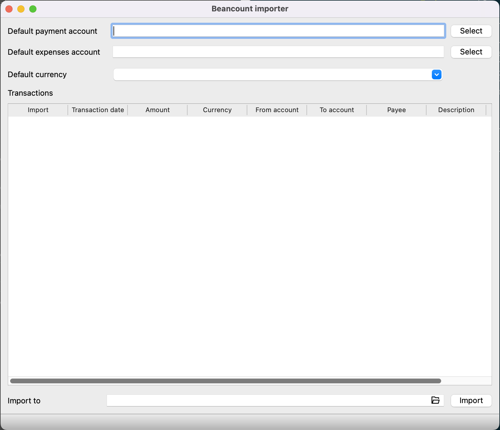

# beancount importer

beancount importer is a GUI tool for importing Alipay/Wechat (and maybe more) bill to beancount file.

## Feature

- Select account from the account hierarchy defining in the beacount file
- Select currency defining in the beacount file
- Choose the transactions to import
- Modify the transaction field on table

## Screenshot



## Prerequisite

- Install Python 3 (>= 3.7)

```
pip install beancount PyQt5
```

## Run

```
python3 main.py
```

## Todo

- [ ] Add date selector
- [ ] Support income transaction
- [ ] Add wechat importer
- [ ] Generate payee to account map based on beancount file
- [ ] Prevent duplicate transaction
- [ ] i18n
- [ ] Select by date range
- [ ] Separate from account and to account dialog
- [ ] Save undone work

## Thanks

[Remix Icon](https://remixicon.com/)
